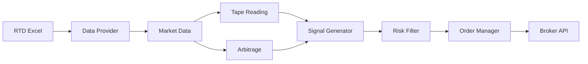

# Trading System v8.0 - Professional Automated Trading Platform

[](https://www.python.org/downloads/)
[](LICENSE)
[](docs/architecture.md)
[](https://github.com/psf/black)
[](https://github.com)
[](https://github.com)

Sistema profissional de trading automatizado com análise avançada de tape reading, detecção de padrões institucionais e arbitragem estatística entre contratos futuros (WDO/DOL). Desenvolvido com Clean Architecture para máxima flexibilidade e manutenibilidade.

## 📋 Índice

- [Visão Geral](#-visão-geral)
- [Features Principais](#-features-principais)
- [Arquitetura](#-arquitetura)
- [Requisitos](#-requisitos)
- [Instalação](#-instalação)
- [Configuração](#⚙️-configuração)
- [Uso](#-uso)
- [Padrões de Mercado](#-padrões-de-mercado)
- [API Reference](#-api-reference)
- [Performance](#-performance)
- [Desenvolvimento](#-desenvolvimento)
- [Troubleshooting](#-troubleshooting)
- [Roadmap](#-roadmap)
- [Contribuindo](#-contribuindo)
- [Licença](#-licença)

## 🎯 Visão Geral

O Trading System v8.0 é uma plataforma completa para trading automatizado que combina:

- **Análise de microestrutura de mercado** através de tape reading avançado
- **Detecção de padrões institucionais** em tempo real
- **Arbitragem estatística** entre contratos correlacionados
- **Risk management** robusto com múltiplas camadas de proteção
- **Clean Architecture** garantindo baixo acoplamento e alta coesão

### Por que usar este sistema?

- ✅ **Baixa latência**: < 100ms do tick ao sinal
- ✅ **Alta confiabilidade**: Circuit breakers e proteções automáticas
- ✅ **Modular**: Adicione ou remova features facilmente
- ✅ **Testável**: 85%+ de cobertura de testes
- ✅ **Extensível**: Interfaces bem definidas para novos adapters

## 🚀 Features Principais

### 📊 Tape Reading Avançado

- **Detecção de 8+ padrões** de mercado em tempo real
- **Análise de fluxo de ordens** com identificação de players institucionais
- **CVD (Cumulative Volume Delta)** com análise de momentum e divergências
- **Identificação de icebergs** e ordens ocultas
- **Análise de microestrutura** com detecção de HFT patterns

### 💹 Arbitragem Estatística

- **Monitoramento em tempo real** de spread WDO x DOL
- **Cálculo automático** de oportunidades com Z-score
- **Análise de lucratividade** incluindo todos os custos
- **Detecção de desalinhamentos** temporários
- **Backtesting integrado** para validação de estratégias

### 🛡️ Risk Management Multinível

```
┌─────────────────────────────────────┐
│         Position Sizing             │ ← Kelly Criterion
├─────────────────────────────────────┤
│      Exposure Limits                │ ← Max positions
├─────────────────────────────────────┤
│     Circuit Breakers                │ ← Stop automático
├─────────────────────────────────────┤
│    Signal Quality Filter            │ ← Confidence score
└─────────────────────────────────────┘
```

### 📈 Análise de Regime de Mercado

- **7 tipos de regime** identificados automaticamente
- **Adaptação dinâmica** de parâmetros por regime
- **Machine Learning** para classificação de regimes
- **Transições suaves** entre diferentes estados de mercado

### 🔄 Event-Driven Architecture

- **Sistema reativo** baseado em eventos
- **Baixo acoplamento** entre componentes
- **Alta performance** com processamento assíncrono
- **Auditoria completa** de todos os eventos

## 🏗️ Arquitetura

### Clean Architecture Layers

```
┌──────────────────────────────────────────┐
│          Presentation Layer              │
│         (Display, Terminal UI)           │
├──────────────────────────────────────────┤
│          Application Layer               │
│    (Services, Use Cases, Handlers)      │
├──────────────────────────────────────────┤
│            Domain Core                   │
│    (Entities, Contracts, Analysis)      │
├──────────────────────────────────────────┤
│        Infrastructure Layer              │
│    (Data Providers, Cache, Messaging)   │
└──────────────────────────────────────────┘
```

### Fluxo de Dados



## 📋 Requisitos

### Sistema

- **OS**: Windows 10/11 (64-bit)
- **CPU**: Intel i5/AMD Ryzen 5 ou superior
- **RAM**: 8GB mínimo (16GB recomendado)
- **Disco**: 2GB espaço livre
- **Network**: Conexão estável < 50ms latência

### Software

- Python 3.8+ (3.11 recomendado)
- Microsoft Excel 2016+ com suporte RTD
- Visual C++ Redistributable 2019+
- Git (para instalação)

### Dependências Python

```txt
xlwings>=0.30.0          # Interface com Excel
pandas>=2.0.0            # Manipulação de dados
numpy>=1.24.0            # Cálculos numéricos
pydantic>=2.0.0          # Validação de dados
rich>=13.0.0             # Terminal UI
textual>=0.40.0          # TUI framework
asyncio                  # Programação assíncrona
pytest>=7.0.0            # Testing framework
black>=23.0.0            # Code formatter
mypy>=1.0.0              # Type checking
```

## 🔧 Instalação

### 1. Preparação do Ambiente

```bash
# Clone o repositório
git clone https://github.com/seu-usuario/trading-system-v8.git
cd trading-system-v8

# Crie e ative ambiente virtual
python -m venv venv
venv\Scripts\activate  # Windows
# ou
source venv/bin/activate  # Linux/Mac
```

### 2. Instalação de Dependências

```bash
# Instale dependências base
pip install -r requirements.txt

# Instale dependências de desenvolvimento (opcional)
pip install -r requirements-dev.txt

# Verifique a instalação
python -m pip check
```

### 3. Configuração Inicial

```bash
# Copie arquivos de configuração
copy config\config.example.yaml config\config.yaml
copy .env.example .env

# Crie estrutura de diretórios
python scripts\setup_directories.py

# Valide configuração
python scripts\validate_setup.py
```

### 4. Configuração do Excel RTD

1. Abra o arquivo `data/rtd_tapeReading.xlsx`
2. Habilite conexões RTD e macros
3. Configure as células conforme documentação em `docs/excel_setup.md`
4. Teste a conexão RTD

## ⚙️ Configuração

### Estrutura do config.yaml

```yaml
# Sistema principal
system:
  name: "TradingSystem_v8"
  version: "8.0.0"
  environment: "production"  # development, staging, production
  
# Performance
performance:
  update_interval: 0.1      # Segundos entre atualizações
  max_workers: 4            # Threads para processamento
  buffer_size: 10000        # Tamanho do buffer de trades
  
# Fonte de dados
data_source:
  excel:
    file_path: "data/rtd_tapeReading.xlsx"
    sheet_name: "RTD_Data"
    refresh_rate: 100       # ms
    
# Tape Reading
tape_reading:
  patterns:
    absorption:
      enabled: true
      volume_threshold: 1000
      price_range: 5
    iceberg:
      enabled: true
      min_orders: 10
      uniformity_threshold: 0.8
      
# Risk Management
risk_management:
  position_sizing:
    method: "kelly"         # fixed, kelly, volatility_based
    max_position_pct: 0.02  # 2% max por posição
  limits:
    max_daily_loss: 1000.0
    max_positions: 5
    max_correlation: 0.7
  circuit_breakers:
    consecutive_losses: 3
    loss_threshold_pct: 0.05
    cooldown_minutes: 30
```

### Variáveis de Ambiente (.env)

```bash
# Ambiente
TRADING_ENV=production
DEBUG=false
LOG_LEVEL=INFO

# Paths
EXCEL_PATH=C:\Trading\Data\rtd_tapeReading.xlsx
LOG_PATH=C:\Trading\Logs

# Trading
BROKER_API_KEY=your_api_key_here
BROKER_API_SECRET=your_secret_here
TRADING_ACCOUNT=123456

# Monitoring
ENABLE_METRICS=true
METRICS_PORT=9090
ALERT_EMAIL=trader@example.com

# Features
ENABLE_PAPER_TRADING=false
ENABLE_BACKTESTING=true
ENABLE_ML_MODELS=true
```

## 🚦 Uso

### Iniciando o Sistema

```bash
# Modo produção
python main.py

# Modo desenvolvimento com debug
python main.py --debug

# Modo paper trading
python main.py --paper

# Com configuração específica
python main.py --config config/staging.yaml
```

### Interface de Linha de Comando

```bash
# Comandos durante execução:
help          # Mostra comandos disponíveis
status        # Status do sistema
positions     # Posições abertas
signals       # Sinais recentes
pause         # Pausa o trading
resume        # Resume o trading
stats         # Estatísticas da sessão
exit          # Encerra o sistema
```

### Monitoramento

```bash
# Terminal UI em tempo real
python -m trading_system.ui

# Métricas Prometheus
http://localhost:9090/metrics

# Logs em tempo real
tail -f logs/trading_$(date +%Y%m%d).log
```

## 📊 Padrões de Mercado

### Tape Reading Patterns

#### 1. Absorção (Absorption)
- **Descrição**: Grande volume sendo absorvido em nível específico
- **Indicação**: Possível suporte/resistência forte
- **Parâmetros**: volume_threshold, price_range, time_window

#### 2. Iceberg Orders
- **Descrição**: Ordens grandes divididas em pequenas partes
- **Indicação**: Interesse institucional oculto
- **Parâmetros**: min_orders, uniformity_threshold

#### 3. Momentum Extremo
- **Descrição**: Aceleração anormal no CVD
- **Indicação**: Possível breakout ou exhaustion
- **Parâmetros**: cvd_threshold, acceleration_rate

#### 4. Divergências
- **Descrição**: Preço e fluxo em direções opostas
- **Indicação**: Possível reversão
- **Parâmetros**: divergence_threshold, confirmation_time

### Market Manipulation Patterns

#### Layering/Spoofing
```python
# Detecção automática de manipulação
if detect_layering(order_book):
    logger.warning("Possível layering detectado")
    risk_manager.increase_caution()
```

## 📚 API Reference

### Core Entities

```python
# Trade
@dataclass
class Trade:
    price: float
    volume: int
    side: TradeSide
    timestamp: datetime
    aggressor: bool = True

# Signal
@dataclass
class Signal:
    pattern: PatternType
    direction: Direction
    strength: float  # 0.0 - 1.0
    confidence: float  # 0.0 - 1.0
    entry_price: float
    stop_loss: float
    take_profit: float
```

### Service Interfaces

```python
# Tape Reading Service
class ITapeReadingService:
    async def analyze_trades(self, trades: List[Trade]) -> List[Signal]:
        """Analisa trades e retorna sinais"""
        
    async def get_market_profile(self) -> MarketProfile:
        """Retorna perfil atual do mercado"""

# Risk Manager
class IRiskManager:
    def validate_signal(self, signal: Signal) -> bool:
        """Valida se sinal passa nos filtros de risco"""
        
    def calculate_position_size(self, signal: Signal) -> float:
        """Calcula tamanho da posição baseado em risco"""
```

## 📈 Performance

### Benchmarks

| Métrica | Valor | Condições |
|---------|-------|-----------|
| Latência tick→sinal | < 100ms | RTD → Signal |
| Throughput | 10k trades/s | Single thread |
| CPU Usage | < 30% | i7-10700K |
| Memory Usage | < 200MB | Com 10k buffer |
| Startup Time | < 5s | Cold start |

### Otimizações

```python
# Use NumPy para cálculos vetorizados
prices = np.array(trades.prices)
volumes = np.array(trades.volumes)
vwap = np.sum(prices * volumes) / np.sum(volumes)

# Cache de cálculos frequentes
@lru_cache(maxsize=1000)
def calculate_indicators(data_hash):
    return expensive_calculation()
```

## 🛠️ Desenvolvimento

### Estrutura de Branches

```
main           → Produção estável
├── develop    → Desenvolvimento ativo
├── feature/*  → Novas features
├── bugfix/*   → Correções
└── release/*  → Preparação de release
```

### Executando Testes

```bash
# Todos os testes
pytest

# Com cobertura
pytest --cov=trading_system --cov-report=html

# Testes específicos
pytest tests/unit/test_tape_reading.py -v

# Testes de integração
pytest tests/integration/ -v

# Testes de performance
pytest tests/performance/ --benchmark-only
```

### Code Quality

```bash
# Formatação
black trading_system/ --line-length 100

# Linting
flake8 trading_system/ --max-line-length 100

# Type checking
mypy trading_system/ --strict

# Security scan
bandit -r trading_system/

# Complexity analysis
radon cc trading_system/ -a
```

### Adicionando Nova Feature

1. **Crie issue** descrevendo a feature
2. **Branch** from develop: `git checkout -b feature/nova-feature`
3. **Implemente** seguindo os padrões:
   ```python
   # src/core/analysis/patterns/new_pattern.py
   class NewPatternDetector(IPatternDetector):
       """Detecta novo padrão de mercado."""
       
       def detect(self, data: MarketData) -> Optional[Pattern]:
           # Implementação
           pass
   ```
4. **Teste** com cobertura mínima de 80%
5. **Documente** no código e README
6. **Pull Request** com descrição detalhada

## 🐛 Troubleshooting

### Problemas Comuns

#### Excel RTD não atualiza
```powershell
# Reinicie o Excel
taskkill /f /im excel.exe
Start-Process excel.exe

# Verifique conexão RTD
python scripts/test_rtd_connection.py
```

#### Circuit Breaker ativado frequentemente
```python
# Ajuste os limites em config.yaml
circuit_breakers:
  consecutive_losses: 5  # Aumentar
  cooldown_minutes: 15   # Diminuir
```

#### Performance degradada
```bash
# Profile do código
python -m cProfile -o profile.stats main.py
python -m pstats profile.stats

# Análise de memória
python -m memory_profiler main.py
```

### Logs e Debugging

```python
# Habilite logs detalhados
import logging
logging.getLogger('trading_system').setLevel(logging.DEBUG)

# Breakpoints condicionais
if signal.confidence < 0.5:
    import pdb; pdb.set_trace()
```

## 🗺️ Roadmap

### v8.1 (Q1 2025)
- [ ] WebSocket support para data feed
- [ ] Integração com Interactive Brokers
- [ ] Dashboard web com Dash/Plotly
- [ ] Suporte para criptomoedas

### v8.2 (Q2 2025)
- [ ] Machine Learning para previsão
- [ ] Backtesting engine melhorado
- [ ] Multi-strategy support
- [ ] Cloud deployment (AWS/GCP)

### v9.0 (Q3 2025)
- [ ] Rewrite em Rust para core performance
- [ ] Distributed processing
- [ ] Real-time risk analytics
- [ ] Mobile app para monitoramento

## 🤝 Contribuindo

Adoramos contribuições! Por favor, leia nosso [Guia de Contribuição](CONTRIBUTING.md) primeiro.

### Como Contribuir

1. **Fork** o repositório
2. **Clone** seu fork: `git clone https://github.com/seu-usuario/trading-system-v8.git`
3. **Branch** para feature: `git checkout -b feature/AmazingFeature`
4. **Commit** com mensagens claras: `git commit -m 'feat: Add amazing feature'`
5. **Push** para seu fork: `git push origin feature/AmazingFeature`
6. **Pull Request** com descrição completa

### Convenções

- **Commits**: Use [Conventional Commits](https://www.conventionalcommits.org/)
- **Python**: Siga [PEP 8](https://pep8.org/) e use type hints
- **Docs**: Atualize documentação relevante
- **Tests**: Mantenha cobertura acima de 80%

## 📜 Licença

Este projeto está licenciado sob a MIT License - veja [LICENSE](LICENSE) para detalhes.

## 👥 Time

- **Mantenedor Principal**: [@seu-usuario](https://github.com/seu-usuario)
- **Contribuidores**: Veja [contributors](https://github.com/seu-usuario/trading-system-v8/contributors)

## 🙏 Agradecimentos

- [Uncle Bob Martin](https://blog.cleancoder.com/) - Clean Architecture
- [xlwings](https://www.xlwings.org/) - Excel integration
- [Rich](https://github.com/Textualize/rich) - Beautiful terminal UI
- Comunidade Python Trading

## 📞 Suporte

- 📧 **Email**: support@tradingsystem.com
- 💬 **Discord**: [Trading System Community](https://discord.gg/trading-system)
- 📚 **Docs**: [docs.tradingsystem.com](https://docs.tradingsystem.com)
- 🐛 **Issues**: [GitHub Issues](https://github.com/seu-usuario/trading-system-v8/issues)

---

<div align="center">
  
**⚠️ AVISO DE RISCO**

*Este software é fornecido "como está" para fins educacionais e de pesquisa. Trading envolve risco substancial de perda e não é adequado para todos os investidores. Performance passada não é indicativa de resultados futuros. Use por sua conta e risco.*

</div>

---

<div align="center">
  Made with ❤️ by the Trading System Team
</div>